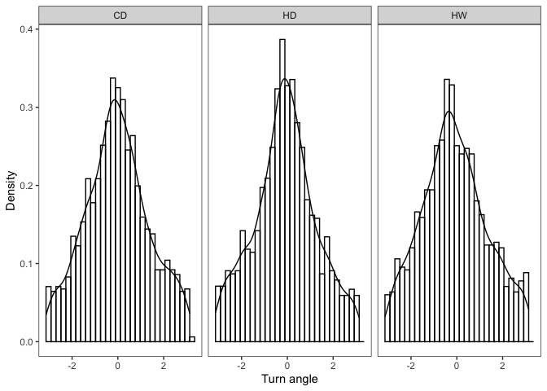
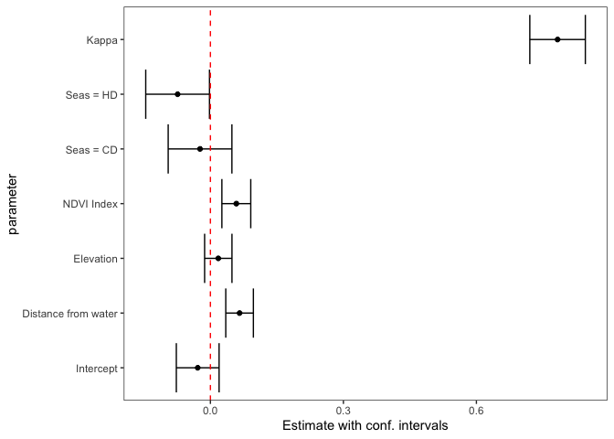
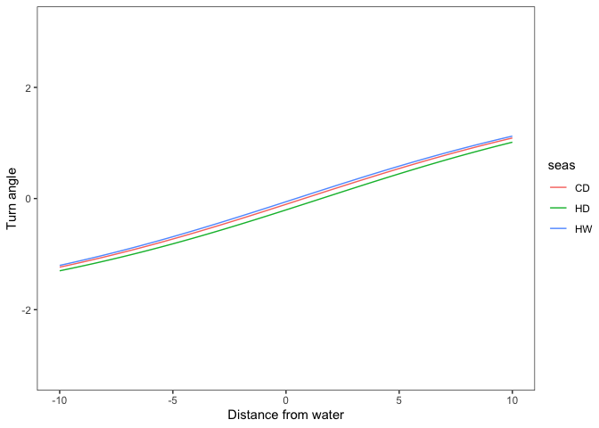
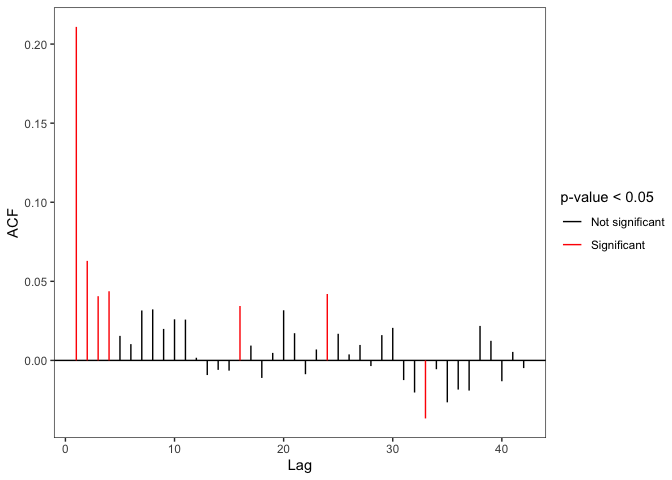
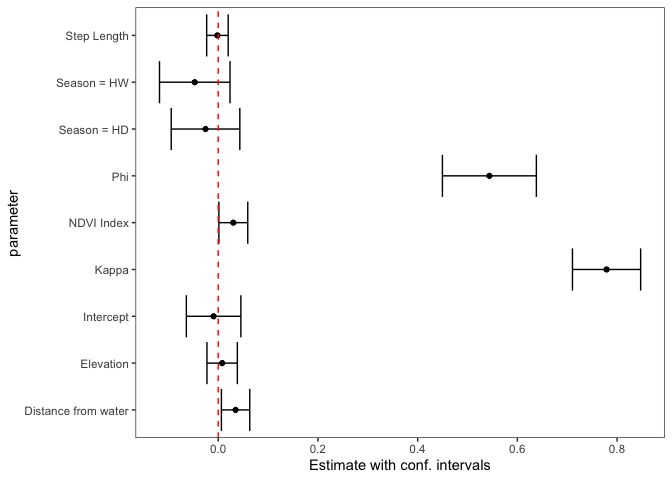

# Analisi del primo elefante (id: GON09)

## Analisi esplorativa dei dati

L’istogramma rappresenta la distribuzione del turn angle nelle tre
stagioni climatiche

## Modello di base

Vogliamo verificare se il *turn angle* sia influenzato dalle variabili a
disposizione, cioè la distanza dalla riva `distriv`, l’altitudine
`elev`, l’indice `ndvi` e la stagione `seas`.

- La funzione di verosimiglianza è definita assumendo

$$
\boldsymbol{\mu} = 2 \cdot \arctan(\mathbf{X} \boldsymbol{\beta}) = 2 \cdot \arctan(\eta_i)
$$

dove:

- $\mathbf{X} = (1, \text{distriv}, \text{elev}, \text{ndvi}, \text{seas})$
- $\boldsymbol{\beta} = (\beta_0, \beta_1, \dots, \beta_k)$
- In altri termini, assumiamo per il turn angle (`ta`) il seguente
  modello:

$$
y_i \propto \beta_0 + \beta_1 \cdot \text{distriv}_i + \beta_2 \cdot \text{elev}_i + 
\beta_3 \cdot \text{ndvi}_i + \beta_4 \cdot \text{seasCD}_i + \beta_5 \cdot \text{seasHD}_i
$$

- La variabile `seas` è trattata come fattore con base la stagione “hot
  dry” (`HD`);
- Le covariate sono standardizzate per migliorare l’interpretabilità dei
  coefficienti stimati.

| Parameter | Estimate | Std. Error | 95% CI Lower | 95% CI Upper | Wald test | p-value |
|:---|:--:|:--:|:--:|:--:|:---|:--:|
| Intercept | -0.0286620 | 0.0246015 | -0.0768801 | 0.0195562 | -1.1650477 | 0.2439997 |
| Distance from water | 0.0657889 | 0.0158919 | 0.0346412 | 0.0969365 | 4.1397640 | 0.0000348 |
| Elevation | 0.0177731 | 0.0157416 | -0.0130798 | 0.0486261 | 1.1290546 | 0.2588748 |
| NDVI Index | 0.0584497 | 0.0166215 | 0.0258722 | 0.0910273 | 3.5165106 | 0.0004373 |
| Seas = CD | -0.0233875 | 0.0366697 | -0.0952588 | 0.0484837 | -0.6377894 | 0.5236108 |
| Seas = HD | -0.0739954 | 0.0366818 | -0.1458904 | -0.0021004 | -2.0172233 | 0.0436722 |
| Kappa | 0.7831093 | 0.0319528 | 0.7204831 | 0.8457356 | 24.5083501 | 0.0000000 |

### Analisi dei residui

I residui ($res = y^{oss} - \hat{y}$) sono sempre compresi in $-\pi$ a
$+\pi$ e assumono i seguenti valori:

- $> 0$ se $y^{oss} > \hat{y}$ cioè quando gira più a sinistra (senso
  antiorario) rispetto al previsto
- $< 0$ se $y^{oss} < \hat{y}$ cioè quando gira più a destra (senso
  orario) rispetto al previsto

Si vuole verificare se i residui al tempo $t$ siano correlati con i
residui al tempo $t-1, \dots, t - n$

- Trattandosi di dati angolari il coefficiente di correlazione è
  definito come \[see @fisher_statistical_2000\]:

$$
 \rho_c(\alpha, \beta) = \frac{E\{ sin(\alpha - \mu) sin(\beta - \nu) \}}{\sqrt{\text{Var}(sin(\alpha - \mu)) \text{Var}(sin(\beta - \nu)) }}
$$

Un problema che si incontra con questo dataset riguarda il fatto che non
tutte le osservazioni sono ad intervalli regolari tra di loro

- Le osservazioni della stessa *burst* hanno una differenza di quattro
  ore tra una e l’altra, ma tra una *burst* e un’altra la distanza
  temporale è molto superiore
- Per ovviare a questo problema la funzione cerca un *match* tra
  l’orario desiderato e un’orario osservato nei dati

| Lag             | \# of matches |    ACF     | Statistic  |  p-value  | Signif |
|:----------------|:-------------:|:----------:|:----------:|:---------:|:------:|
| 4 hours         |     3840      | 0.2108695  | 12.7790440 | 0.0000000 |   \*   |
| 8 hours         |     3754      | 0.0629276  | 3.8594955  | 0.0001136 |   \*   |
| 12 hours        |     3676      | 0.0405987  | 2.4323716  | 0.0150003 |   \*   |
| 16 hours        |     3617      | 0.0437213  | 2.6113399  | 0.0090188 |   \*   |
| 20 hours        |     3575      | 0.0155138  | 0.9258975  | 0.3544992 |        |
| 1 days          |     3529      | 0.0102943  | 0.6053022  | 0.5449782 |        |
| 1 days 4 hours  |     3499      | 0.0315702  | 1.8654774  | 0.0621145 |        |
| 1 days 8 hours  |     3454      | 0.0322577  | 1.8962908  | 0.0579216 |        |
| 1 days 12 hours |     3427      | 0.0199160  | 1.1563505  | 0.2475378 |        |
| 1 days 16 hours |     3390      | 0.0259891  | 1.5256545  | 0.1270959 |        |
| 1 days 20 hours |     3368      | 0.0258089  | 1.4993403  | 0.1337854 |        |
| 2 days          |     3348      | 0.0016813  | 0.0961374  | 0.9234115 |        |
| 2 days 4 hours  |     3333      | -0.0092577 | -0.5320208 | 0.5947116 |        |
| 2 days 8 hours  |     3313      | -0.0059767 | -0.3445676 | 0.7304195 |        |
| 2 days 12 hours |     3294      | -0.0064732 | -0.3718897 | 0.7099750 |        |
| 2 days 16 hours |     3278      | 0.0344011  | 1.9737571  | 0.0484094 |   \*   |
| 2 days 20 hours |     3268      | 0.0093746  | 0.5364765  | 0.5916293 |        |
| 3 days          |     3251      | -0.0110770 | -0.6283882 | 0.5297497 |        |
| 3 days 4 hours  |     3227      | 0.0047574  | 0.2693177  | 0.7876852 |        |
| 3 days 8 hours  |     3212      | 0.0316978  | 1.8090955  | 0.0704362 |        |
| 3 days 12 hours |     3201      | 0.0172016  | 0.9777822  | 0.3281821 |        |
| 3 days 16 hours |     3200      | -0.0087226 | -0.4902195 | 0.6239786 |        |
| 3 days 20 hours |     3196      | 0.0069127  | 0.3896559  | 0.6967910 |        |
| 4 days          |     3192      | 0.0419850  | 2.3593622  | 0.0183064 |   \*   |
| 4 days 4 hours  |     3188      | 0.0168362  | 0.9543760  | 0.3398934 |        |
| 4 days 8 hours  |     3182      | 0.0038022  | 0.2148321  | 0.8298982 |        |
| 4 days 12 hours |     3172      | 0.0097776  | 0.5503106  | 0.5821063 |        |
| 4 days 16 hours |     3165      | -0.0035751 | -0.1996419 | 0.8417607 |        |
| 4 days 20 hours |     3159      | 0.0159845  | 0.9041370  | 0.3659227 |        |
| 5 days          |     3147      | 0.0205790  | 1.1627935  | 0.2449133 |        |
| 5 days 4 hours  |     3141      | -0.0124448 | -0.6998309 | 0.4840329 |        |
| 5 days 8 hours  |     3137      | -0.0202963 | -1.1376863 | 0.2552515 |        |
| 5 days 12 hours |     3129      | -0.0366864 | -2.0437890 | 0.0409744 |   \*   |
| 5 days 16 hours |     3126      | -0.0055690 | -0.3133299 | 0.7540301 |        |
| 5 days 20 hours |     3121      | -0.0265082 | -1.4873393 | 0.1369252 |        |
| 6 days          |     3115      | -0.0184409 | -1.0325926 | 0.3017946 |        |
| 6 days 4 hours  |     3101      | -0.0190703 | -1.0670868 | 0.2859327 |        |
| 6 days 8 hours  |     3096      | 0.0218073  | 1.2073036  | 0.2273152 |        |
| 6 days 12 hours |     3090      | 0.0123942  | 0.6974668  | 0.4855107 |        |
| 6 days 16 hours |     3084      | -0.0131727 | -0.7342971 | 0.4627677 |        |
| 6 days 20 hours |     3077      | 0.0053800  | 0.2966406  | 0.7667409 |        |
| 7 days          |     3071      | -0.0048582 | -0.2671484 | 0.7893549 |        |

## Modello AR(1)

Dato che dalla funzione di autocorrelazione emerge una correlazione
significativa dei primi 4 lag, cioè i residui al tempo $t-1$ (4 ore),
$t-2$ (8 ore), $t-3$ (12 ore), $t-4$ (16 ore) sono correlati con i
residui al tempo $t$, e non è quindi possibile assumere indipendenza tra
le osservazioni, la funzione di log-verosimiglianza è ridefinita per
tenerne conto come segue:

- Siano:
- $\eta = \mathbf{X}\boldsymbol{\beta}$: il predittore lineare
- $e_{t-1} = y_{t-1} - 2 \cdot \arctan(\eta_{t-1})$: i residui al tempo
  t-1
- Assumiamo:

$$
\mu_t = 2 \cdot \arctan(\eta_{t}) + \arctan(\frac{\phi \cdot \sin(e_{t-1})}{k_t})
$$

e

$$
k_t = \sqrt{k^2 + [\phi \cdot \sin(e_{t-1})]^2}
$$

| Parameter | Estimate | Std. Error | 95% CI Lower | 95% CI Upper | Wald test | p-value |
|:---|:--:|:--:|:--:|:--:|:---|:--:|
| Intercept | -0.0092380 | 0.0278918 | -0.0639048 | 0.0454289 | -0.3312075 | 0.7404878 |
| Step Length | -0.0015765 | 0.0110155 | -0.0231664 | 0.0200134 | -0.1431140 | 0.8862001 |
| Distance from water | 0.0348190 | 0.0145136 | 0.0063728 | 0.0632652 | 2.3990533 | 0.0164375 |
| NDVI Index | 0.0302760 | 0.0147799 | 0.0013080 | 0.0592441 | 2.0484649 | 0.0405145 |
| Elevation | 0.0078912 | 0.0155444 | -0.0225754 | 0.0383577 | 0.5076539 | 0.6116961 |
| Season = HD | -0.0254751 | 0.0350979 | -0.0942658 | 0.0433155 | -0.7258303 | 0.4679428 |
| Season = HW | -0.0470482 | 0.0360794 | -0.1177626 | 0.0236662 | -1.3040161 | 0.1922281 |
| Phi | 0.5438737 | 0.0480659 | 0.4496663 | 0.6380811 | 11.3151747 | 0.0000000 |
| Kappa | 0.7788618 | 0.0348791 | 0.7105001 | 0.8472235 | 22.3303501 | 0.0000000 |

### Verifiche sul fit

