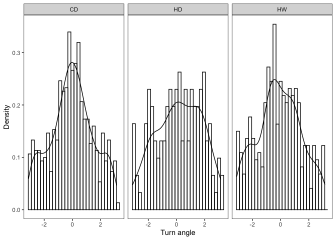
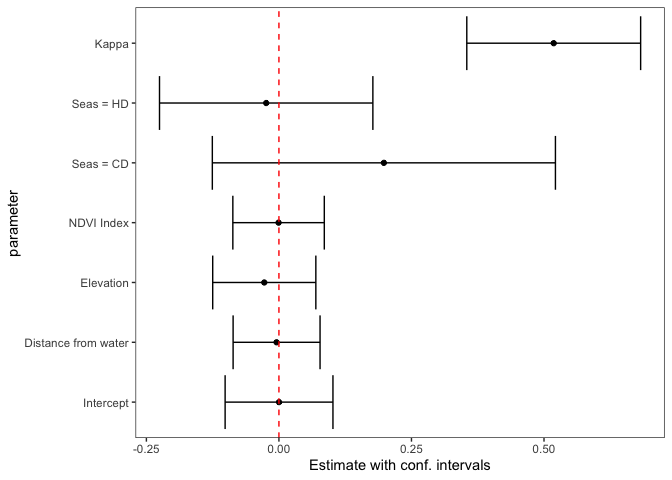
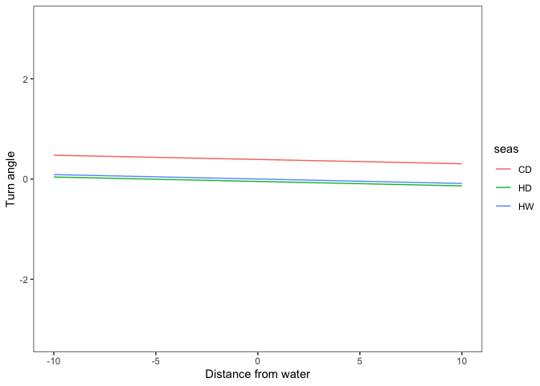
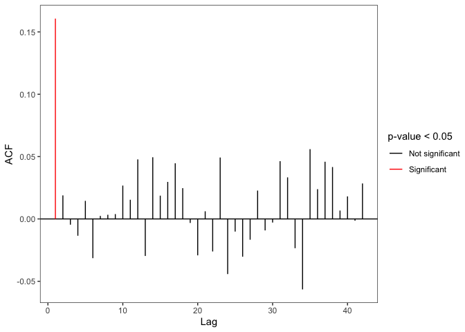
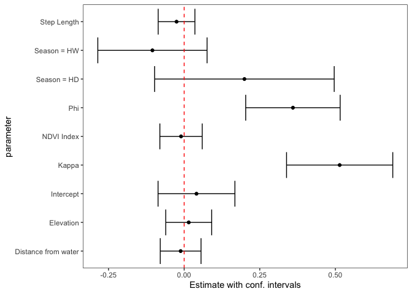

# Analisi del secondo elefante (id: GON10)

## Analisi esplorativa dei dati

L’istogramma rappresenta la distribuzione del turn angle nelle tre
stagioni climatiche

## Modello di base

Vogliamo verificare se il *turn angle* sia influenzato dalle variabili a
disposizione, cioè la distanza dalla riva `distriv`, l’altitudine
`elev`, l’indice `ndvi` e la stagione `seas`.

- La funzione di verosimiglianza è definita assumendo

$$
\boldsymbol{\mu} = 2 \cdot \arctan(\mathbf{X} \boldsymbol{\beta}) = 2 \cdot \arctan(\eta_i)
$$

dove:

- $\mathbf{X} = (1, \text{distriv}, \text{elev}, \text{ndvi}, \text{seas})$
- $\boldsymbol{\beta} = (\beta_0, \beta_1, \dots, \beta_k)$
- In altri termini, assumiamo per il turn angle (`ta`) il seguente
  modello:

$$
y_i \propto \beta_0 + \beta_1 \cdot \text{distriv}_i + \beta_2 \cdot \text{elev}_i + 
\beta_3 \cdot \text{ndvi}_i + \beta_4 \cdot \text{seasCD}_i + \beta_5 \cdot \text{seasHD}_i
$$

- La variabile `seas` è trattata come fattore con base la stagione “hot
  dry” (`HD`);
- Le covariate sono standardizzate per migliorare l’interpretabilità dei
  coefficienti stimati.

| Parameter | Estimate | Std. Error | 95% CI Lower | 95% CI Upper | Wald test | p-value |
|:---|:--:|:--:|:--:|:--:|:---|:--:|
| Intercept | 0.0002046 | 0.0518857 | -0.1014896 | 0.1018987 | 0.0039425 | 0.9968544 |
| Distance from water | -0.0044250 | 0.0418357 | -0.0864216 | 0.0775716 | -0.1057710 | 0.9157640 |
| Elevation | -0.0276379 | 0.0496289 | -0.1249087 | 0.0696329 | -0.5568912 | 0.5776018 |
| NDVI Index | -0.0006699 | 0.0440087 | -0.0869253 | 0.0855855 | -0.0152216 | 0.9878554 |
| Seas = CD | 0.1979655 | 0.1650964 | -0.1256175 | 0.5215484 | 1.1990901 | 0.2304929 |
| Seas = HD | -0.0240319 | 0.1026683 | -0.2252580 | 0.1771941 | -0.2340738 | 0.8149277 |
| Kappa | 0.5183117 | 0.0836535 | 0.3543538 | 0.6822696 | 6.1959333 | 0.0000000 |

### Analisi dei residui

I residui ($res = y^{oss} - \hat{y}$) sono sempre compresi in $-\pi$ a
$+\pi$ e assumono i seguenti valori:

- $> 0$ se $y^{oss} > \hat{y}$ cioè quando gira più a sinistra (senso
  antiorario) rispetto al previsto
- $< 0$ se $y^{oss} < \hat{y}$ cioè quando gira più a destra (senso
  orario) rispetto al previsto

Si vuole verificare se i residui al tempo $t$ siano correlati con i
residui al tempo $t-1, \dots, t - n$

- Trattandosi di dati angolari il coefficiente di correlazione è
  definito come \[see @fisher_statistical_2000\]:

$$
 \rho_c(\alpha, \beta) = \frac{E\{ sin(\alpha - \mu) sin(\beta - \nu) \}}{\sqrt{\text{Var}(sin(\alpha - \mu)) \text{Var}(sin(\beta - \nu)) }}
$$

Un problema che si incontra con questo dataset riguarda il fatto che non
tutte le osservazioni sono ad intervalli regolari tra di loro

- Le osservazioni della stessa *burst* hanno una differenza di quattro
  ore tra una e l’altra, ma tra una *burst* e un’altra la distanza
  temporale è molto superiore
- Per ovviare a questo problema la funzione cerca un *match* tra
  l’orario desiderato e un’orario osservato nei dati

| Lag             | \# of matches |    ACF     | Statistic  |  p-value  | Signif |
|:----------------|:-------------:|:----------:|:----------:|:---------:|:------:|
| 4 hours         |     1163      | 0.1606737  | 5.4526317  | 0.0000000 |   \*   |
| 8 hours         |     1150      | 0.0188977  | 0.6470760  | 0.5175827 |        |
| 12 hours        |     1138      | -0.0045991 | -0.1546502 | 0.8770971 |        |
| 16 hours        |     1126      | -0.0134660 | -0.4550464 | 0.6490758 |        |
| 20 hours        |     1123      | 0.0144937  | 0.4918664  | 0.6228138 |        |
| 1 days          |     1120      | -0.0314595 | -1.0475127 | 0.2948632 |        |
| 1 days 4 hours  |     1117      | 0.0024375  | 0.0803809  | 0.9359344 |        |
| 1 days 8 hours  |     1114      | 0.0033480  | 0.1109210  | 0.9116790 |        |
| 1 days 12 hours |     1111      | 0.0038885  | 0.1299777  | 0.8965841 |        |
| 1 days 16 hours |     1108      | 0.0267486  | 0.8845192  | 0.3764160 |        |
| 1 days 20 hours |     1105      | 0.0153828  | 0.5153146  | 0.6063332 |        |
| 2 days          |     1102      | 0.0477640  | 1.5890735  | 0.1120438 |        |
| 2 days 4 hours  |     1099      | -0.0296922 | -0.9878322 | 0.3232348 |        |
| 2 days 8 hours  |     1096      | 0.0494710  | 1.6339260  | 0.1022744 |        |
| 2 days 12 hours |     1093      | 0.0186893  | 0.6287705  | 0.5294993 |        |
| 2 days 16 hours |     1090      | 0.0297069  | 0.9860588  | 0.3241043 |        |
| 2 days 20 hours |     1087      | 0.0446304  | 1.4478609  | 0.1476560 |        |
| 3 days          |     1084      | 0.0246857  | 0.8040304  | 0.4213794 |        |
| 3 days 4 hours  |     1081      | -0.0032099 | -0.1058777 | 0.9156794 |        |
| 3 days 8 hours  |     1079      | -0.0291983 | -0.9584148 | 0.3378536 |        |
| 3 days 12 hours |     1077      | 0.0061396  | 0.2010106  | 0.8406902 |        |
| 3 days 16 hours |     1074      | -0.0260811 | -0.8725813 | 0.3828914 |        |
| 3 days 20 hours |     1071      | 0.0492711  | 1.6330396  | 0.1024607 |        |
| 4 days          |     1067      | -0.0442197 | -1.4396611 | 0.1499633 |        |
| 4 days 4 hours  |     1063      | -0.0101205 | -0.3261815 | 0.7442870 |        |
| 4 days 8 hours  |     1061      | -0.0302878 | -0.9946165 | 0.3199228 |        |
| 4 days 12 hours |     1059      | -0.0166583 | -0.5411737 | 0.5883879 |        |
| 4 days 16 hours |     1057      | 0.0227521  | 0.7373089  | 0.4609345 |        |
| 4 days 20 hours |     1055      | -0.0091980 | -0.3023942 | 0.7623516 |        |
| 5 days          |     1051      | -0.0028835 | -0.0908636 | 0.9276010 |        |
| 5 days 4 hours  |     1048      | 0.0463283  | 1.4700943  | 0.1415362 |        |
| 5 days 8 hours  |     1045      | 0.0333353  | 1.0642539  | 0.2872137 |        |
| 5 days 12 hours |     1042      | -0.0234610 | -0.7584869 | 0.4481595 |        |
| 5 days 16 hours |     1040      | -0.0565223 | -1.8264928 | 0.0677761 |        |
| 5 days 20 hours |     1037      | 0.0559687  | 1.8134281  | 0.0697658 |        |
| 6 days          |     1034      | 0.0238717  | 0.7625301  | 0.4457437 |        |
| 6 days 4 hours  |     1031      | 0.0458803  | 1.4445403  | 0.1485871 |        |
| 6 days 8 hours  |     1028      | 0.0416201  | 1.3347822  | 0.1819477 |        |
| 6 days 12 hours |     1025      | 0.0067296  | 0.2166973  | 0.8284442 |        |
| 6 days 16 hours |     1022      | 0.0180828  | 0.5745220  | 0.5656146 |        |
| 6 days 20 hours |     1019      | -0.0014079 | -0.0450476 | 0.9640693 |        |
| 7 days          |     1016      | 0.0284527  | 0.9153474  | 0.3600093 |        |

## Modello AR(1)

Dato che dalla funzione di autocorrelazione emerge una correlazione
significativa dei primi 4 lag, cioè i residui al tempo $t-1$ (4 ore),
$t-2$ (8 ore), $t-3$ (12 ore), $t-4$ (16 ore) sono correlati con i
residui al tempo $t$, e non è quindi possibile assumere indipendenza tra
le osservazioni, la funzione di log-verosimiglianza è ridefinita per
tenerne conto come segue:

- Siano:
- $\eta = \mathbf{X}\boldsymbol{\beta}$: il predittore lineare
- $e_{t-1} = y_{t-1} - 2 \cdot \arctan(\eta_{t-1})$: i residui al tempo
  t-1
- Assumiamo:

$$
\mu_t = 2 \cdot \arctan(\eta_{t}) + \arctan(\frac{\phi \cdot \sin(e_{t-1})}{k_t})
$$

e

$$
k_t = \sqrt{k^2 + [\phi \cdot \sin(e_{t-1})]^2}
$$

    ERROR : L-BFGS-B needs finite values of 'fn' 

| Parameter | Estimate | Std. Error | 95% CI Lower | 95% CI Upper | Wald test | p-value |
|:---|:--:|:--:|:--:|:--:|:---|:--:|
| Intercept | 0.0407203 | 0.0647957 | -0.0862770 | 0.1677175 | 0.6284409 | 0.5297152 |
| Step Length | -0.0251796 | 0.0309606 | -0.0858612 | 0.0355020 | -0.8132794 | 0.4160579 |
| Distance from water | -0.0116466 | 0.0344048 | -0.0790788 | 0.0557855 | -0.3385181 | 0.7349728 |
| NDVI Index | -0.0103454 | 0.0357228 | -0.0803608 | 0.0596701 | -0.2896005 | 0.7721219 |
| Elevation | 0.0150986 | 0.0387574 | -0.0608646 | 0.0910618 | 0.3895661 | 0.6968574 |
| Season = HD | 0.1992918 | 0.1514681 | -0.0975801 | 0.4961637 | 1.3157350 | 0.1882630 |
| Season = HW | -0.1049562 | 0.0921788 | -0.2856233 | 0.0757109 | -1.1386154 | 0.2548636 |
| Phi | 0.3596732 | 0.0796845 | 0.2034945 | 0.5158519 | 4.5137168 | 0.0000064 |
| Kappa | 0.5142008 | 0.0895991 | 0.3385898 | 0.6898118 | 5.7389054 | 0.0000000 |

### Verifiche sul fit

## Modello AR alternativo

Ai fini del confronto delle performance dei due modelli, si specifica
anche un modello autoregressivo più semplice della forma:

$$
\mu_t = 2 \cdot \arctan(\eta_{t}) + \sum_{i=1}^L \phi_i y_{t-i} 
$$

- dove $L$ è il numero di lag

<!-- -->

     [1] -80.853461931  -0.133259245 -80.853461825  -6.465945835 -80.853461865
     [6] -14.624602392 -10.700433389 -12.016320294 -12.915347600  -6.052936380
    [11] -17.729266596  -8.823301159 -13.189759406  -0.002586864  -6.465945822
    [16] -80.853461629  -6.465945798 -13.128892919  -3.189296068 -80.853461891

| Parameter | Estimate | Std. Error | 95% CI Lower | 95% CI Upper | Wald test | p-value |
|:---|:--:|:--:|:--:|:--:|:---|:--:|
| Intercept | 0.0407203 | 0.0647957 | -0.0862770 | 0.1677175 | 0.6284409 | 0.5297152 |
| Step Length | -0.0251796 | 0.0309606 | -0.0858612 | 0.0355020 | -0.8132794 | 0.4160579 |
| Distance from water | -0.0116466 | 0.0344048 | -0.0790788 | 0.0557855 | -0.3385181 | 0.7349728 |
| NDVI Index | -0.0103454 | 0.0357228 | -0.0803608 | 0.0596701 | -0.2896005 | 0.7721219 |
| Elevation | 0.0150986 | 0.0387574 | -0.0608646 | 0.0910618 | 0.3895661 | 0.6968574 |
| Season = HD | 0.1992918 | 0.1514681 | -0.0975801 | 0.4961637 | 1.3157350 | 0.1882630 |
| Season = HW | -0.1049562 | 0.0921788 | -0.2856233 | 0.0757109 | -1.1386154 | 0.2548636 |
| Phi | 0.3596732 | 0.0796845 | 0.2034945 | 0.5158519 | 4.5137168 | 0.0000064 |
| Kappa | 0.5142008 | 0.0895991 | 0.3385898 | 0.6898118 | 5.7389054 | 0.0000000 |

### Verifiche sul modello alternativo

