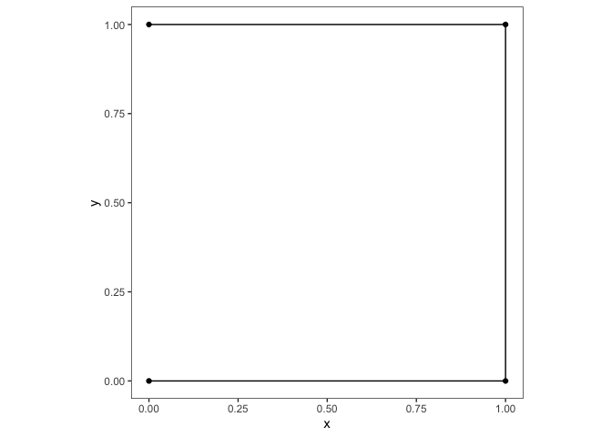
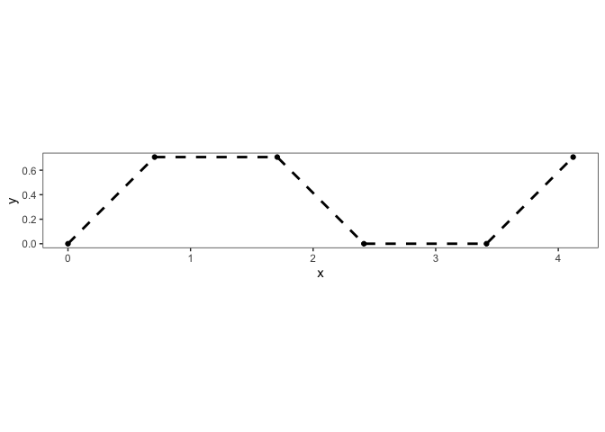

# Preparazione dei dati

## Introduzione

Se sono disponibili dati sulla posizione degli animali registrata a
intervalli regolare, per analizzarne il movimento degli animali vengono
utilizzate tre metriche:

1.  La *step length*, misurata come [distanza
    euclidea](https://en.wikipedia.org/wiki/Euclidean_distance) tra due
    rilevazioni successive.

> [!NOTE]
>
> Se la posizione è registrata in gradi, anche la distanza euclidea sarà
> in gradi. È opportuno in questo caso convertire le coordinate in un
> sistema di proiezione metrica.

2.  La *direction*, misurata come
    [`atan2`](https://en.wikipedia.org/wiki/Atan2), espressa in radianti
    e compresa tra $-\pi$ e $\pi$. Lo 0 indica l’est geografico.
3.  Il *turn angle* misurato come differenza tra *direction* (cioè
    `atan2`) successivi.

## Verifiche sul pacchetto `amt`

Per la preparazione dei dati verrà utilizzato il pacchetto `amt`: è
fondamentale in via preliminare verificare che i calcoli che avvengono
all’interno del pacchetto corrispondano a quelli descritti sopra. Per
farlo, vengono creati manualmente dei semplici dati di input e si
calcolano le metriche analiticamente.

| Step Length | Direction | Turn angle |
|------------:|----------:|-----------:|
|           1 |     0.000 |         NA |
|           1 |     0.785 |      0.785 |
|           1 |     1.571 |      0.785 |

I risultati ottenuti possono ora essere confrontati con quelli ottenuti
tramite il pacchetto.

| Step Length | Direction | Turn angle |
|------------:|----------:|-----------:|
|           1 |     0.000 |         NA |
|           1 |     1.571 |      1.571 |
|           1 |     3.142 |      1.571 |

Un altro elemento essenziale da comprendere, soprattutto nell’ottica
dell’analisi dei residui, è il segno del *turn angle*

- Se il segno del *turn angle* è negativo vuol dire che l’animale ha
  girato in senso orario
- Per verificarlo e visualizzarlo creo un percorso in cui la *step
  length* è fissa ($=1$) e l’animale si muove in quattro direzioni
  ($\pi/4, 0, -\pi/4, 0$) e in cui ci aspettiamo che i primi due *turn
  angle* siano negativi mentre il terzo e il quarto siano positivi

| Step |     x |     y | Direction | Turn angle |
|-----:|------:|------:|----------:|-----------:|
|    0 | 0.000 | 0.000 |        NA |         NA |
|    1 | 0.707 | 0.707 |     0.785 |         NA |
|    2 | 1.707 | 0.707 |     0.000 |     -0.785 |
|    3 | 2.414 | 0.000 |    -0.785 |     -0.785 |
|    4 | 3.414 | 0.000 |     0.000 |      0.785 |
|    5 | 4.121 | 0.707 |     0.785 |      0.785 |

## Preparazione dei dati (id elefante: GON09)

Le principali funzioni per la preparazione dei dati sono le seguenti:

- `amt::make_track()` crea un “track” cioè una tibble contenente le
  coordinate x e y, il tempo (t) e un sistema di riferimento di
  coordinate (CRS). Questa tibble verrà utilizzata dal pacchetto per le
  operazioni successive. Nel nostro caso il CRS è identificato con
  EPSG:21036, Arc 1960, UTM zone 36S.

<!-- -->

- `amt::summarize_sampling_rate()` fornisce la distribuzione della
  frequenza di campionamento e consente di vedere se le registrazione
  della posizione sono state costanti e con che intervallo.

|       min |       q1 |   median |     mean |       q3 |      max |       sd |    n | unit |
|----------:|---------:|---------:|---------:|---------:|---------:|---------:|-----:|:-----|
| 0.0002778 | 3.994722 | 4.000556 | 4.219743 | 4.006667 | 296.0897 | 4.759062 | 4831 | hour |

- `amt::track_resample()` unito a `filter_min_n_burst(3)` permettono di
  conservare le osservazioni solo nel caso in cui in cui le
  registrazioni della posizione avvengono ad un intervallo costante (nel
  nostro caso 4h $\pm$ 15 min) per almeno tre registrazioni consecutive
- `steps_by_burst()` passa da un `df` in cui ogni riga corrisponde ad
  una posizione ad uno in cui ogni riga corrisponde ad un passo. Per
  ogni passo, sono incluse le variabili coordinate di inizio (x1\_, y1\_
  ), cordinate finali (x2\_, y2\_ ), tempo di inizio e di fine (t1\_,
  t2\_ ), step length (sl\_; in CRS units), turning angles (ta\_; in
  degrees), la time difference (dt\_ ) e la burst (sequenza di passi con
  intervallo di registrazione di 4h) (burst\_ ) a cui appartiene il
  *step*

<!-- -->

- L’ultimo passaggio per la preparazione dei dati consiste
  nell’associazione delle covariate ambientali agli spostamenti
  dell’animale. Abbiamo a disposizione, per ogni posizione, la distanza
  dalla riva (`distriv`), l’indice NDVI (`ndvi`), l’elevazione (`elev`)
  e la stagione (`seas`). Quest’ultima è una variabile con tre livelli:
  hot wet (`HW`) (Da Novembre a Marzo, quando si verifica il 90% delle
  piogge annuali); cool dry (`CD`) (Da aprile ad agosto) e hot dry
  (`HD`) (da Settembre a Ottobre) \[@mandinyenya_sex_2024\]
- È importante notare che il fatto che le covariate siano associate al
  punto di arrivo e non al punto di partenza, modifica sostanzialmente
  la domanda di ricerca. Cioè si investiga in questo modo quale sia la
  relazione tra il modo in cui si muove l’animale e il luogo verso il
  quale sta andando.

| burst\_ | x1\_ | x2\_ | y1\_ | y2\_ | sl\_ | direction_p | ta\_ | t1\_ | t2\_ | dt\_ | distriv | ndvi | elev | seas | geometry | distriv_std | elev_std | ndvi_std |
|---:|---:|---:|---:|---:|---:|---:|---:|:---|:---|:---|---:|---:|---:|:---|:---|---:|---:|---:|
| 5 | 415.06 | 414.39 | -2340.00 | -2339.49 | 0.84 | 2.49 | NA | 2016-02-03 13:57:54 | 2016-02-03 17:58:00 | 4.00 hours | 0.69 | 2677 | 507 | HW | POINT (414.3919 -2339.493) | -0.83 | 1.45 | -0.95 |
| 5 | 414.39 | 413.71 | -2339.49 | -2338.76 | 1.00 | 2.32 | -0.17 | 2016-02-03 17:58:00 | 2016-02-03 21:58:02 | 4.00 hours | 1.69 | 2512 | 522 | HW | POINT (413.7098 -2338.764) | 0.11 | 1.61 | -1.17 |
| 5 | 413.71 | 414.15 | -2338.76 | -2338.21 | 0.70 | 0.90 | -1.42 | 2016-02-03 21:58:02 | 2016-02-04 01:58:02 | 4.00 hours | 1.88 | 3931 | 504 | HW | POINT (414.1464 -2338.214) | 0.29 | 1.42 | 0.73 |
| 5 | 414.15 | 415.03 | -2338.21 | -2337.89 | 0.94 | 0.36 | -0.54 | 2016-02-04 01:58:02 | 2016-02-04 05:57:59 | 4.00 hours | 1.26 | 3120 | 507 | HW | POINT (415.0256 -2337.887) | -0.29 | 1.45 | -0.35 |
| 5 | 415.03 | 415.18 | -2337.89 | -2338.44 | 0.58 | -1.29 | -1.65 | 2016-02-04 05:57:59 | 2016-02-04 09:58:05 | 4.00 hours | 0.84 | 2634 | 514 | HW | POINT (415.1842 -2338.441) | -0.69 | 1.53 | -1.01 |
| 5 | 415.18 | 413.26 | -2338.44 | -2340.91 | 3.13 | -2.23 | -0.94 | 2016-02-04 09:58:05 | 2016-02-04 13:58:10 | 4.00 hours | 1.34 | 3681 | 501 | HW | POINT (413.2572 -2340.906) | -0.22 | 1.39 | 0.40 |
| 5 | 413.26 | 412.03 | -2340.91 | -2341.73 | 1.48 | -2.55 | -0.32 | 2016-02-04 13:58:10 | 2016-02-04 17:58:13 | 4.00 hours | 1.78 | 3174 | 471 | HW | POINT (412.0313 -2341.73) | 0.20 | 1.09 | -0.28 |
| 5 | 412.03 | 410.50 | -2341.73 | -2343.37 | 2.24 | -2.32 | 0.23 | 2016-02-04 17:58:13 | 2016-02-04 21:58:07 | 4.00 hours | 0.22 | 2394 | 437 | HW | POINT (410.5037 -2343.371) | -1.28 | 0.74 | -1.33 |
| 5 | 410.50 | 410.27 | -2343.37 | -2343.08 | 0.38 | 2.24 | -1.73 | 2016-02-04 21:58:07 | 2016-02-05 01:58:16 | 4.00 hours | 0.57 | 2128 | 440 | HW | POINT (410.2719 -2343.075) | -0.95 | 0.77 | -1.68 |
| 5 | 410.27 | 410.52 | -2343.08 | -2342.77 | 0.40 | 0.90 | -1.34 | 2016-02-05 01:58:16 | 2016-02-05 05:58:04 | 4.00 hours | 0.78 | 2735 | 445 | HW | POINT (410.5176 -2342.766) | -0.75 | 0.82 | -0.87 |
| 5 | 410.52 | 411.15 | -2342.77 | -2342.62 | 0.65 | 0.22 | -0.68 | 2016-02-05 05:58:04 | 2016-02-05 10:00:56 | 4.05 hours | 0.86 | 2881 | 451 | HW | POINT (411.1467 -2342.622) | -0.67 | 0.89 | -0.67 |
| 8 | 414.42 | 413.38 | -2340.33 | -2338.81 | 1.83 | 2.17 | NA | 2016-02-06 17:58:25 | 2016-02-06 21:58:27 | 4.00 hours | 1.88 | 2512 | 523 | HW | POINT (413.3846 -2338.814) | 0.29 | 1.62 | -1.17 |
| 8 | 413.38 | 413.90 | -2338.81 | -2338.29 | 0.74 | 0.79 | -1.38 | 2016-02-06 21:58:27 | 2016-02-07 01:58:20 | 4.00 hours | 1.97 | 3085 | 511 | HW | POINT (413.9046 -2338.291) | 0.37 | 1.50 | -0.40 |
| 8 | 413.90 | 414.25 | -2338.29 | -2338.45 | 0.39 | -0.43 | -1.22 | 2016-02-07 01:58:20 | 2016-02-07 05:58:24 | 4.00 hours | 1.63 | 2822 | 516 | HW | POINT (414.255 -2338.453) | 0.05 | 1.55 | -0.75 |
| 8 | 414.25 | 414.62 | -2338.45 | -2338.86 | 0.55 | -0.84 | -0.41 | 2016-02-07 05:58:24 | 2016-02-07 09:58:35 | 4.00 hours | 1.08 | 2543 | 516 | HW | POINT (414.6188 -2338.859) | -0.46 | 1.55 | -1.13 |

## Secondo elefante (id:)
